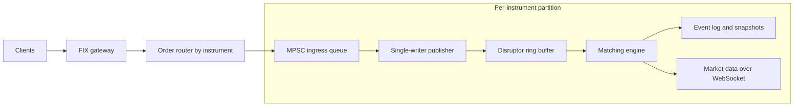
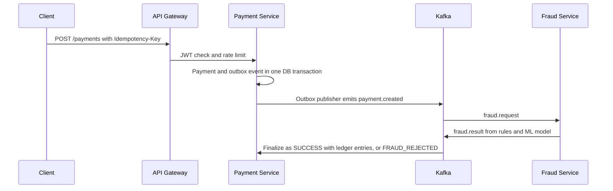
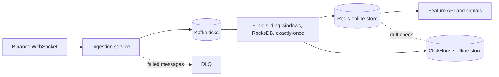

  

**I build correctness-critical backend systems: exchange engines, event-driven payments and real-time streaming pipelines.**
 
SDE intern at Tripfactory · B.Tech, Nirma University · **Open to SDE / Backend roles**

<table>
<tr>
<td align="center"><h3>400K / sec</h3>orders matched at 3µs p50 <a href="https://github.com/anshlakhera048/AxiomX">AxiomX</a></td>
<td align="center"><h3>1,000+ TPS</h3>payments validated with k6 load tests <a href="https://github.com/anshlakhera048/Distributed-Payment-Infrastructure">Payments</a></td>
<td align="center"><h3>3★ | 1638</h3>#56 · Starters 251 CodeChef <a href="#-competitive-programming">Details</a></td>
<td align="center"><h3>35K+ / mo</h3>views teaching backend and systems <a href="https://instagram.com/swe.ngineer">@swe.ngineer</a></td>
</tr>
</table>

[**🌱 Open Source**](#-open-source-contributions) · [**🚀 Projects**](#-featured-projects) · [**💼 Experience**](#-experience) · [**🛠️ Stack**](#️-tech-stack) · [**🏆 CP**](#-competitive-programming)

---

## 🌱 Open Source Contributions

> Contributing upstream to projects I use and learn from. This table updates automatically with my latest merged PRs.

<!--OSS-START-->
| Project | Contribution | Merged |
|---|---|---|
| [JayPokale/Chisle](https://github.com/JayPokale/Chisle) | [feat: report turns in agentic benchmark score](https://github.com/JayPokale/Chisle/pull/35) | 2026-10-04 |
| [JayPokale/Chisle](https://github.com/JayPokale/Chisle) | [feat: add 2026-10-01 rerun benchmark chart](https://github.com/JayPokale/Chisle/pull/34) | 2026-10-03 |
| [JayPokale/Chisle](https://github.com/JayPokale/Chisle) | [feat: break replay savings down by tool](https://github.com/JayPokale/Chisle/pull/30) | 2026-10-03 |
| [SINTEF/Muscade.jl](https://github.com/SINTEF/Muscade.jl) | [docs: move Diagnostic under User manual](https://github.com/SINTEF/Muscade.jl/pull/112) | 2026-10-02 |
<!--OSS-END-->

[**View all my PRs →**](https://github.com/pulls?q=is%3Apr+author%3Aanshlakhera048+-user%3Aanshlakhera048)

---

## 🚀 Featured Projects

### ⚡ [AxiomX](https://github.com/anshlakhera048/AxiomX) — Deterministic exchange matching engine

> A continuous limit order book with price-time priority, FIX gateway, event sourcing and crash recovery, built so every run produces the same result.

| Throughput | Latency | Hot path | Correctness |
|---|---|---|---|
| **400K orders/sec** (250K under mixed load) | **3µs p50** | **8M FIX parses/sec**, zero GC on the matching loop | **116 tests**, deterministic replay from snapshots |

**Key design decisions**
- **Single-writer principle:** many producers feed an Agrona MPSC queue, one publisher feeds a single-producer Disruptor, so ordering is strict with no lock contention.
- **Price-time book:** TreeMap + FIFO price levels give O(log N) match and O(1) cancel.
- **Zero-allocation hot path:** object pooling and primitive collections keep GC off the matching loop.
- **Event sourcing:** every state change is logged, so a crash recovers to the exact same state.

<b>Architecture</b>

 

### 💳 [Distributed Payment Infrastructure](https://github.com/anshlakhera048/Distributed-Payment-Infrastructure)

> An event-driven payment platform designed so there are no duplicate charges and no lost transactions, even when infrastructure fails.

| Scale | Consistency | Idempotency | Resilience |
|---|---|---|---|
| **1,000+ TPS** validated with k6 | **Double-entry ledger**, SUM(DEBIT) = SUM(CREDIT) enforced | **3 tiers:** Redis, DB lock, UNIQUE constraint | Outbox, retries, DLQs, circuit breakers, adaptive backpressure |

**Key design decisions**
- **Transactional outbox:** the payment and its event commit in one DB transaction, which removes the dual-write problem.
- **Effectively-once processing:** idempotent API plus a `processed_events` table make Kafka redeliveries harmless.
- **Two-stage fraud detection:** rules first, then an IsolationForest model with versioning, behind a circuit breaker that fails open.

<b>Payment flow</b>

 

### 📊 [QuantStream](https://github.com/anshlakhera048/QuantStream) — Real-time market feature pipeline

> Binance trade stream to SMA, VWAP and volatility features, served from an online store and an offline store that are continuously checked against each other.

| Throughput | Semantics | Dual store | Testing |
|---|---|---|---|
| **10-20K events/sec** | **Exactly-once** ingest-to-state path, RocksDB with 5s checkpoints | Redis (online) + ClickHouse (offline), **5% drift alerts** | Deterministic replay, load generator, **chaos service**, 16-service Compose stack |

**Key design decisions**
- **Event-time windows:** 60s windows sliding every 5s with watermarks, aggregated incrementally in O(1) per event.
- **Schema discipline:** Avro with Schema Registry, idempotent producers and a DLQ, so bad data is isolated rather than dropped.
- **Verifiable by design:** the repo includes chaos tests for Kafka, Redis and Flink failures, plus consistency and data-quality checkers.

<b>Architecture</b>

---

## 💼 Experience

**Tripfactory** · SDE Intern · Bengaluru · *Jan 2026 - Jun 2026*
- Integrated BPoint REST v5 into B2B booking infrastructure, owning the auth-to-settlement lifecycle across a multi-gateway architecture.
- Built an **idempotent FSM refund engine** with excess-refund prevention and precision-safe arithmetic under concurrency.
- Audited the **CDC pipeline** (Postgres, Debezium, Kafka, ClickHouse) and designed a star-schema warehouse with MergeTree materialized views.
- Built a config-driven **Visa Rule Engine** in Java and a BI dashboard (JS + Chart.js) used across 36+ offices with role-based access.

**Bluestock Fintech** · SDE Intern · Remote · *May 2025 - Jun 2025*
- Built a real-time IPO market dashboard (React, Node, Tailwind) with a modular, WebSocket-ready architecture.

---

## 🛠️ Tech Stack

| Layer | Stack |
|---|---|
| **Languages** | Java · C++ · Python · JavaScript · SQL |
| **Backend** | Spring Boot · REST · Microservices · Resilience4j |
| **Streaming and data** | Kafka · Flink · Avro · Schema Registry · Debezium (CDC) |
| **Low-latency** | LMAX Disruptor · Agrona · fastutil · HdrHistogram |
| **Storage** | PostgreSQL · ClickHouse · Redis |
| **Patterns** | Outbox · Saga · Idempotency · Event sourcing · Double-entry ledger |
| **Infra and observability** | Docker · Kubernetes · Prometheus · Grafana · Linux · k6 |

Also: React · Node.js · Tailwind · JUnit · Mockito

---

## 🏆 Competitive Programming

| Platform | Handle | Highlight |
|---|---|---|
| **LeetCode** | [`anshlakhera048`](https://leetcode.com/u/anshlakhera048) | **Top 3.3% globally** (rank 1011 of 30,750+, Biweekly 148) · max rating 1648 |
| **CodeChef** | [`anshlakhera048`](https://www.codechef.com/users/anshlakhera048) | **3★** · global rank 74 in Starters 251 · max rating 1601 |
| **Codeforces** | [`ansh174`](https://codeforces.com/profile/ansh174) | Active · graphs and DP |

500+ DSA problems solved across platforms

---

## 📡 Teaching what I build

I run **[@swe.ngineer](https://instagram.com/swe.ngineer)**, where I explain backend engineering, system design and AI to **35K+ viewers a month**. Explaining a concept clearly is the best test of whether I understand it.

---

### Let's talk

**Hiring for backend, distributed systems or low-latency work?**

